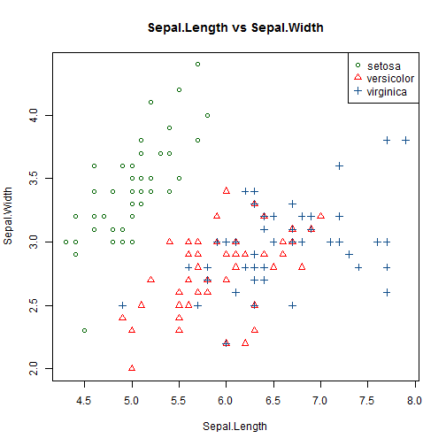

## Exploring Datasets

* You want to better understand the aspects of different species of iris
* Your current strategy dumps out the data in a flat table


```
##   Sepal.Length Sepal.Width Petal.Length Petal.Width Species
## 1          5.1         3.5          1.4         0.2  setosa
## 2          4.9         3.0          1.4         0.2  setosa
## 3          4.7         3.2          1.3         0.2  setosa
## 4          4.6         3.1          1.5         0.2  setosa
## 5          5.0         3.6          1.4         0.2  setosa
## 6          5.4         3.9          1.7         0.4  setosa
```

* This application simplifies the headaches of learning about your data

--- 

## Simplifying Exploratory Analysis

* Selecting different predictors from dropdown menus allows the user to create plots
like the one below in real time without any knowledge of programming.

 

---

## Gamifying Exploration

* One of the fun features of this tool is that you can make predictions based on
an x and y input and see if your expected outcome matches the model built over the dataset.

```
# Build the prediction
x = as.double(input$x_pred)
y = as.double(input$y_pred)
iris_predict = as.data.frame(cbind(x, y))

# Fit an rpart model
modFit = train(s ~ ., method = "rpart", data=iris)

# Round the prediction to the nearest factor values
prediction = round(predict(modFit, iris_predict))
```

---

## Further Uses

1. Changing out minimal backend code allows you to map this example to different datasets.
2. The code could be extended to allow the user to change the outcome they want to predict.
